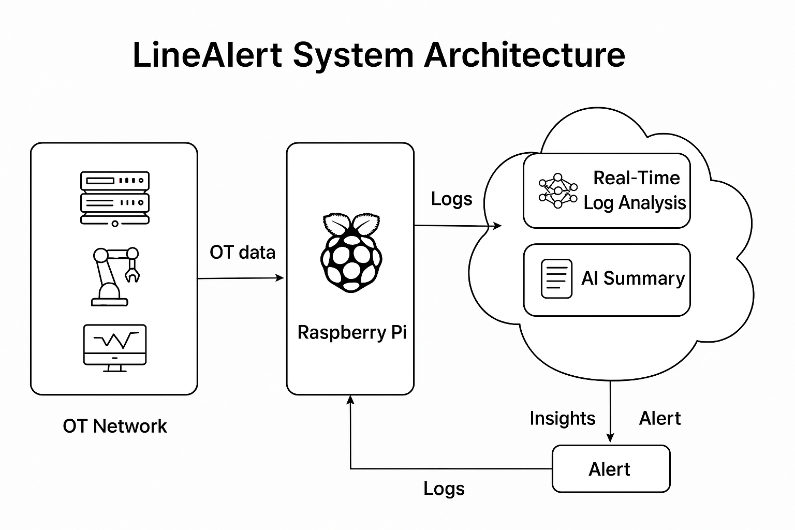

# LineAlert System Design

## Overview
LineAlert is a cutting-edge cybersecurity platform designed to protect Operational Technology (OT) systems. This document provides an overview of the system's architecture and key components.

## Key Components
- **Data Collection**: The system continuously collects data from OT devices (e.g., PLCs, SCADA systems).
- **Data Analysis**: The data is analyzed for anomalies or cybersecurity threats.
- **Alerts**: Real-time alerts are generated when suspicious activity is detected.
- **Adaptive Learning**: The system learns from historical data to improve detection accuracy.

## Architecture Diagram
Below is the architecture diagram for the LineAlert system:

## Deployment
The system is designed to be deployed in small municipalities and critical infrastructure environments. It is flexible and can integrate with existing OT infrastructure.

## Future Enhancements
- **Cloud Integration**: Plans for integrating cloud analytics for enhanced scalability.
- **AI Models**: Further development of machine learning models to better identify and predict threats.
